<div align="center">



# PHRAXIS

### Say the feature. Shape the intent. Ship the pull request.

PHRAXIS turns a spoken engineering idea into a structured, repository-aware implementation flow—powered by IBM Watson, watsonx, IBM Quantum, IBM Bob, and GitHub.

<p>
  <a href="#-quick-start"><strong>Run locally</strong></a>
  ·
  <a href="#-how-it-works"><strong>Explore the pipeline</strong></a>
  ·
  <a href="#-api-surface"><strong>Read the API</strong></a>
  ·
  <a href="./bob_sessions/README.md"><strong>View Bob sessions</strong></a>
</p>


<sub>Built for IBM Bob Dev Day Hackathon 2026 · Theme: Turn Idea into Impact Faster</sub>

</div>

---

## ✦ The idea

Great product decisions often begin as a sentence in a meeting. Turning that sentence into a safe pull request is where momentum disappears: the idea must be transcribed, clarified, mapped onto a codebase, implemented, reviewed, and finally published.

PHRAXIS joins those disconnected steps into one observable workflow.

> “Add rate limiting: 100 requests per minute for free users, 1,000 for premium users, and return `429` with a `Retry-After` header.”

That single request moves through speech recognition, intent extraction, candidate-change optimization, repository-aware code generation, and pull-request creation—while the dashboard shows every stage in real time.

<table>
  <tr>
    <td align="center"><strong>01 · Capture</strong><br/><sub>Voice or text</sub></td>
    <td align="center">→</td>
    <td align="center"><strong>02 · Understand</strong><br/><sub>Structured intent</sub></td>
    <td align="center">→</td>
    <td align="center"><strong>03 · Optimize</strong><br/><sub>Low-conflict plan</sub></td>
    <td align="center">→</td>
    <td align="center"><strong>04 · Build</strong><br/><sub>Repository-aware code</sub></td>
    <td align="center">→</td>
    <td align="center"><strong>05 · Ship</strong><br/><sub>GitHub pull request</sub></td>
  </tr>
</table>

## ⚡ Why PHRAXIS

| The usual handoff | The PHRAXIS workflow |
|---|---|
| Ideas are manually rewritten as tickets | The original spoken request becomes the source of truth |
| Codebase context is gathered repeatedly | IBM Bob works with repository-level context |
| Candidate files are explored ad hoc | QOPE ranks a low-conflict implementation set |
| Progress disappears inside an agent session | Every pipeline event streams into the dashboard |
| The PR description is written after the fact | The original intent and implementation result travel together |

### Designed around three principles

- **Natural input.** Capture an idea while it is fresh, through voice or a text fallback.
- **Visible reasoning.** Show transcription confidence, extracted intent, candidate changes, optimization output, and generation progress.
- **Reviewable output.** Keep a human in the loop and finish with a normal GitHub pull request—not an opaque deployment.

## ◎ How it works

### 1. Speak — browser voice capture

The React client records audio with the browser `MediaRecorder` API. A text mode is available when a microphone is unavailable or precision matters more than speed.

### 2. Understand — Watson STT + NLU

IBM Watson Speech to Text returns the transcript, word timing, and confidence. IBM Natural Language Understanding converts the transcript into a predictable intent object:

```json
{
  "action": "add_rate_limiting",
  "target_module": "middleware",
  "parameters": {
    "free_tier_limit": 100,
    "premium_tier_limit": 1000,
    "window": "minute",
    "error_code": 429
  },
  "constraints": ["return a Retry-After header"],
  "confidence": 0.94
}
```

Cloudant stores the request and its evolving pipeline state as an auditable intent record.

### 3. Optimize — QOPE + QAOA

The **Quantum Optimization Planning Engine (QOPE)** models candidate code changes as a Quadratic Unconstrained Binary Optimization problem. Coverage contributes value; conflicting changes add penalties.

```text
minimize  −Σ coverageᵢ·xᵢ + λΣ conflictᵢⱼ·xᵢ·xⱼ
```

Qiskit converts that model for QAOA execution through IBM Quantum Runtime. The returned subset helps focus generation on a compact, lower-conflict implementation path.

### 4. Build — watsonx + IBM Bob

watsonx enriches the structured request with code-oriented analysis. IBM Bob then provides the repository-aware workflow:

| Bob capability | Role inside PHRAXIS |
|---|---|
| Architect | Maps the target repository and identifies candidate locations |
| Plan | Converts optimized candidates into ordered implementation steps |
| Code | Produces changes that follow the repository’s existing patterns |
| Orchestrate | Coordinates the multi-stage generation flow |
| Review | Checks generated changes before publication |

Session artifacts are retained in [`bob_sessions/`](./bob_sessions/) for inspection.

### 5. Ship — GitHub

PHRAXIS creates a feature branch, commits the generated files, and opens a pull request containing implementation context. The resulting PR remains the review and merge boundary.

## ◈ Product surface

The single-screen workspace keeps the pipeline readable without making the developer chase logs across tools.

| Surface | What it reveals |
|---|---|
| Voice workspace | Recording state, text fallback, and the active request |
| Transcript + intent | Recognition confidence and extracted engineering constraints |
| Quantum panel | Candidate count, selected files, backend, and conflict score |
| Live code stream | Architect, plan, generation, and review events as they happen |
| PR status | Files changed, elapsed time, and the final GitHub destination |

## 🧩 Technology map

| Layer | Technology | Responsibility |
|---|---|---|
| Experience | React 18, Vite, Carbon Design System | Voice input and live pipeline dashboard |
| API | FastAPI, Pydantic, Server-Sent Events | Validation, orchestration, and progress streaming |
| Speech | IBM Watson Speech to Text | Audio transcription and word confidence |
| Language | IBM Watson NLU | Entity, keyword, and semantic-role extraction |
| Memory | IBM Cloudant | Persistent intent and pipeline state |
| Reasoning | IBM watsonx | Codebase-oriented request enrichment |
| Planning | Qiskit, IBM Quantum Runtime | QUBO construction and QAOA optimization |
| Generation | IBM Bob | Repository architecture, planning, coding, and review |
| Delivery | GitHub API, PyGithub | Branch, commit, and pull-request creation |

## 🚀 Quick start

### Prerequisites

- Python 3.11+
- Node.js 20+
- IBM Cloud credentials for Watson STT, Watson NLU, Cloudant, and watsonx
- An IBM Quantum token and configured backend
- A GitHub personal access token with access to the target repository
- IBM Bob available to the backend orchestration environment

### 1 · Clone and configure

```bash
git clone https://github.com/Senaaravichandran/phraxis.git
cd phraxis
cp .env.example .env
```

Fill `.env` with your service credentials. Never commit this file.

### 2 · Start the API

From the repository root:

```bash
python -m venv .venv

# macOS / Linux
source .venv/bin/activate

# Windows PowerShell
# .venv\Scripts\Activate.ps1

pip install -r backend/requirements.txt
uvicorn backend.main:app --reload --port 8000
```

The API is available at `http://localhost:8000`; interactive OpenAPI docs are at `http://localhost:8000/docs`.

### 3 · Start the dashboard

In a second terminal:

```bash
cd frontend
npm install
npm run dev
```

Open `http://localhost:3000`, dismiss the demo notice, then record a request or switch to text mode.

### 4 · Check service health

```bash
curl http://localhost:8000/api/health
```

> [!IMPORTANT]
> PHRAXIS can create branches, commits, and pull requests in the configured target repository. Use a sandbox repository and a least-privilege token while evaluating the project.

## 🔐 Configuration

Copy [`.env.example`](./.env.example) and provide these values:

| Variable | Required | Purpose |
|---|:---:|---|
| `IBM_STT_API_KEY` | ✓ | Watson Speech to Text credential |
| `IBM_STT_URL` | ✓ | Watson Speech to Text service URL |
| `IBM_NLU_API_KEY` | ✓ | Watson NLU credential |
| `IBM_NLU_URL` | ✓ | Watson NLU service URL |
| `IBM_CLOUDANT_URL` | ✓ | Cloudant instance URL |
| `IBM_CLOUDANT_API_KEY` | ✓ | Cloudant credential |
| `WATSONX_API_KEY` | ✓ | watsonx credential |
| `WATSONX_PROJECT_ID` | ✓ | watsonx project identifier |
| `WATSONX_MODEL_ID` | ✓ | Model used for request enrichment |
| `WATSONX_URL` | ✓ | watsonx service URL |
| `IBM_QUANTUM_TOKEN` | ✓ | IBM Quantum Runtime credential |
| `IBM_QUANTUM_BACKEND` | ✓ | Runtime backend selected by QOPE |
| `GITHUB_TOKEN` | ✓ | Target-repository credential |
| `GITHUB_REPO_OWNER` | ✓ | Target repository owner |
| `GITHUB_REPO_NAME` | ✓ | Target repository name |
| `DEMO_REPO_PATH` | — | Optional local demo-repository override |
| `DEMO_REPO_URL` | — | Optional remote demo-repository override |

## 🔌 API surface

All routes are served by FastAPI from `http://localhost:8000`.

| Method | Endpoint | Purpose |
|:---:|---|---|
| `POST` | `/api/voice/transcribe` | Transcribe a multipart audio upload |
| `POST` | `/api/intent/extract` | Extract and persist structured intent |
| `POST` | `/api/quantum/optimize` | Select candidates with QOPE |
| `GET` | `/api/generate/code` | Stream generation progress with SSE |
| `POST` | `/api/pr/open` | Commit generated files and open a PR |
| `GET` | `/api/intents` | List recent intent records |
| `GET` | `/api/intents/{intent_id}` | Read a specific intent record |
| `GET` | `/api/prs` | List recent repository pull requests |
| `GET` | `/api/pr/{pr_number}` | Read one pull request |
| `GET` | `/api/health` | Report configured service health |

<details>
<summary><strong>Example: extract an intent</strong></summary>

```bash
curl -X POST http://localhost:8000/api/intent/extract \
  -H "Content-Type: application/json" \
  -d '{"transcript":"Add rate limiting to the payments API"}'
```

</details>

<details>
<summary><strong>Example: optimize candidate changes</strong></summary>

```bash
curl -X POST http://localhost:8000/api/quantum/optimize \
  -H "Content-Type: application/json" \
  -d '{
    "doc_id": "INTENT_DOCUMENT_ID",
    "candidate_changes": [
      {"file_path":"middleware/rate_limit.py","coverage_weight":1.0},
      {"file_path":"app.py","coverage_weight":0.7}
    ],
    "conflict_matrix": [[0,1],[1,0]]
  }'
```

</details>

## 🗂 Repository guide

```text
phraxis/
├── backend/
│   ├── main.py                    # FastAPI routes and orchestration
│   ├── env_loader.py              # Configuration validation
│   └── services/
│       ├── stt_service.py         # Watson speech recognition
│       ├── nlu_service.py         # Intent extraction
│       ├── cloudant_service.py    # Intent persistence
│       ├── qope.py                # QUBO + QAOA planning
│       ├── watsonx_service.py     # watsonx enrichment
│       ├── bob_orchestrator.py    # Repository-aware generation
│       └── github_service.py      # Branch, commit, and PR delivery
├── frontend/
│   └── src/
│       ├── App.jsx                # Pipeline state and layout
│       └── components/            # Voice, intent, quantum, code, PR panels
├── demo-repo/                     # Local target used by the demo workflow
├── bob_sessions/                  # Exported Bob evidence and logs
├── .github/workflows/             # Generated-code validation workflow
├── demo_runner.py                 # End-to-end demo launcher
└── README.md
```

## 🧪 Validation

Build the frontend:

```bash
cd frontend
npm ci
npm run build
```

Compile the Python modules:

```bash
python -m compileall backend
```

Run the repository’s pipeline checks:

```bash
python test_pipeline.py
```

## 🤖 IBM Bob evidence

PHRAXIS was developed with IBM Bob and also uses Bob as a runtime orchestration layer. Exported architect logs, plans, session records, integration notes, and review material live in [`bob_sessions/`](./bob_sessions/).

This makes the project’s agent-assisted workflow inspectable instead of asking reviewers to trust a black box.

## 🛡 Responsible use

- Treat generated code as a proposed change, not an automatic production deployment.
- Review the candidate set, generated diff, tests, and pull-request description.
- Keep credentials out of logs and commits; `.env` is already ignored.
- Prefer a scoped GitHub token and a dedicated evaluation repository.
- Verify IBM service availability, quota, and cost before a full demo run.

## 🌱 Contributing

Issues and pull requests are welcome. Keep changes focused, document new environment variables, and include validation steps for both the React client and FastAPI service.

1. Fork the repository.
2. Create a branch: `git switch -c feature/your-change`.
3. Make and validate the change.
4. Open a pull request describing the intent and observed result.

---

<div align="center">

**PHRAXIS** — from *phronesis* (practical wisdom) × *praxis* (action).

<sub>Practical wisdom, transformed into working software.</sub>

</div>
